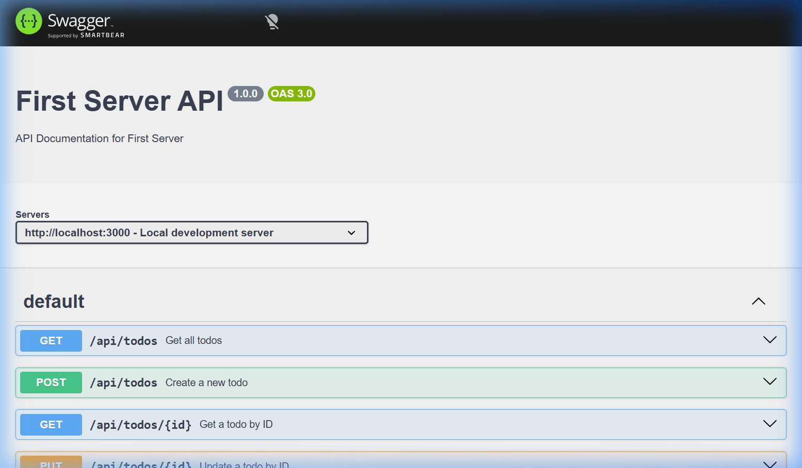

# First Server API

A lightweight **RESTful Todo API** built with **Express** and **TypeScript**. Todos are persisted as JSON on [Cloudinary](https://cloudinary.com), validated with [Zod](https://zod.dev), and fully documented through a built-in **Swagger UI**.

---

## Tech Stack

| Layer       | Library                                      |
| ----------- | -------------------------------------------- |
| Runtime     | Node.js + TypeScript                         |
| Framework   | Express 5                                    |
| Validation  | Zod                                          |
| Storage     | Cloudinary (raw JSON upload)                 |
| Docs        | Swagger UI Express                           |
| Dev tooling | `tsc --watch` + `nodemon` via `concurrently` |

---

## Getting Started

### 1. Clone & install

```bash
git clone https://github.com/OlaOluwalekan/first-server.git
cd first-server
pnpm install
```

### 2. Configure environment

Create a `.env` file in the project root:

```env
CLOUDINARY_CLOUD_NAME=your_cloud_name
CLOUDINARY_API_KEY=your_api_key
CLOUDINARY_API_SECRET=your_api_secret
CLOUDINARY_JSON_FILE_URL=https://res.cloudinary.com/.../<file>.json
CLOUDINARY_PUBLIC_ID=your_public_id
```

### 3. Run in development

```bash
pnpm dev
```

> This single command runs **`tsc --watch`** and **`nodemon`** concurrently — TypeScript recompiles on every save and the server restarts automatically.

Server starts at **http://localhost:3000**.

---

## API Endpoints

Base URL: `http://localhost:3000`

| Method   | Endpoint         | Description             |
| -------- | ---------------- | ----------------------- |
| `GET`    | `/api/todos`     | Retrieve all todos      |
| `POST`   | `/api/todos`     | Create a new todo       |
| `GET`    | `/api/todos/:id` | Get a single todo by ID |
| `PUT`    | `/api/todos/:id` | Update a todo by ID     |
| `DELETE` | `/api/todos/:id` | Delete a todo by ID     |

### Request body (POST / PUT)

```json
{
  "title": "string (3–100 chars)",
  "description": "string (3–255 chars)",
  "completed": false
}
```

### Unified response envelope

```json
{
  "success": true | false,
  "error": null | "error message",
  "data": { ... } | null
}
```

---

## Live Example — `curl -i` Output

```
$ curl -i -X GET http://localhost:3000/api/todos

HTTP/1.1 200 OK
X-Powered-By: Express
Content-Type: application/json; charset=utf-8
Content-Length: 289
ETag: W/"121-fuVK5z/kEvbJ+KekUJlCchkqS7c"
Date: Fri, 17 Jul 2026 15:35:15 GMT
Connection: keep-alive
Keep-Alive: timeout=5

{
  "success": true,
  "error": null,
  "data": {
    "todos": [
      {
        "id": "fe6aeba8-da65-4f1d-859c-5d8bc94012b5",
        "title": "My First Task (Updated)",
        "description": "This is the updated description for my first task",
        "completed": true,
        "createdAt": "2026-07-17T14:02:36.625Z",
        "updatedAt": "2026-07-17T14:13:02.241Z"
      }
    ]
  }
}
```

---

## Swagger UI

Interactive API documentation is available at **http://localhost:3000/api/docs**.



---

## Project Structure

```
first-server/
├── src/
│   ├── controllers/     # Route handlers
│   ├── docs/            # OpenAPI JSON spec
│   ├── models/          # Zod schemas
│   ├── routes/          # Express routers
│   ├── templates/       # EJS views (index.ejs)
│   ├── types/           # TypeScript interfaces
│   ├── utils/           # File read/write helpers
│   └── server.ts        # App entry point
├── dist/                # Compiled output (git-ignored)
├── docs/                # Project assets (screenshots etc.)
├── .env                 # Environment variables (git-ignored)
├── tsconfig.json
└── package.json
```

---

## License

ISC
